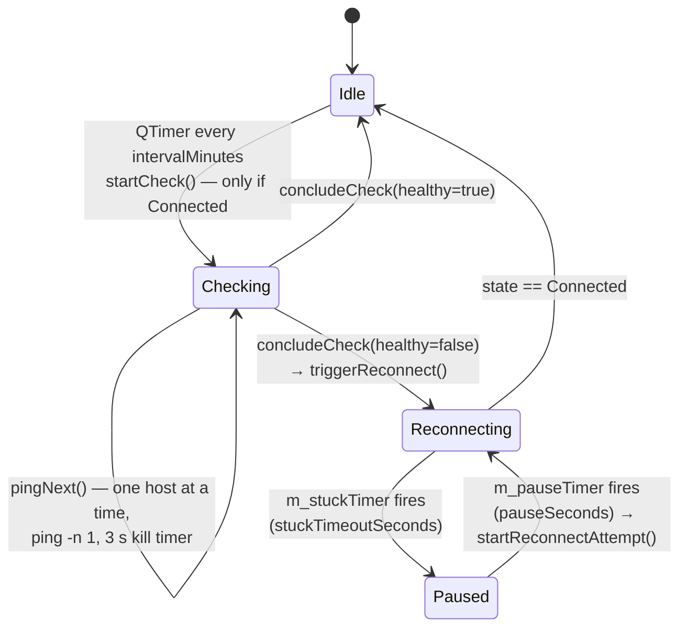

# 🔁 Auto-reconnect — setup guide and which hosts to enter

> 🇷🇺 Русская версия: [SETUP_RU.md](./SETUP_RU.md)
> 🏗️ How it is implemented (code): see [§6](#6-how-it-works-code-map)

**The problem it solves:** the VPN tunnel silently dies (ISP drop at night, NAT timeout, Wi-Fi roaming), the client still shows *Connected*, and nothing works until you reconnect by hand.
**What it does:** every *N* minutes the client pings a list of hosts **through the tunnel**; when they stop answering it disconnects and reconnects to the default server, with a guard against a reconnect that hangs.

Page: **Settings → Auto-reconnect** (also reachable from the *Auto-reconnect enabled* indicator on the home screen).

---

## 1. Settings, one by one

| Setting | Default | Meaning |
|---|---|---|
| **Auto-reconnect** (switch) | off | Master toggle. The watchdog only supervises an *active* connection — it never fights a manual disconnect. |
| **Check interval, minutes** | `10` (min 1) | How often the host list is pinged. |
| **Reconnect when…** | *all hosts unreachable* | `all hosts unreachable` — reconnect only when **every** host fails (robust, recommended). `any host unreachable` — reconnect as soon as **one** host fails (aggressive; a single flaky host will cause reconnects). |
| **Random ping order** | off | Shuffle the list before each check — spreads the load and avoids always starting with the same host. |
| **Stuck-connection recovery — timeout, s** | `120` (min 10) | If an *automatic* reconnect stays in *Preparing/Connecting/Reconnecting* longer than this, the attempt is aborted. |
| **Stuck-connection recovery — pause, s** | `120` (min 5) | Cooldown after an aborted attempt before the next one. |
| **Hosts** | `1.1.1.1`, `8.8.8.8` | One host per line; **Test** under each one pings it 4× right now and shows IP / packets / RTT; 🗑 removes it. |
| **Check now** | — | Runs a check immediately (only while connected). |
| **Event log** | all 4 categories on | Timestamped log at `%APPDATA%\AmneziaVPN\log\reconnect-events.log`, categories: *Connection*, *Auto-reconnect*, *Ping check*, *Host test*. *Open* / *Clear* buttons. |

A host counts as **reachable** only if `ping` exits 0 **and** its output contains `ttl=` — Windows exits 0 even for *Destination host unreachable*, so the exit code alone is not trusted. Each ping is a single packet with a 3-second kill timer.

---

## 2. Which hosts to enter — and why

The whole point is to detect that **the tunnel** is dead, so the hosts must be addresses that **actually go through the VPN**. Think of it as three tiers and take at least one from tier A and one from tier B:

### Tier A — "is the tunnel alive at all?"

| Host | Why |
|---|---|
| **your VPN server's public IP** *(inside the tunnel it is the peer endpoint)* | Reachable ⇒ the physical link is fine. With WireGuard/AWG the ping to the server IP goes *outside* the tunnel (endpoint route), so if this **fails** the problem is your ISP, not the VPN — a reconnect will not help but also does no harm. Use it as a sanity reference. |
| **the tunnel's internal gateway** (e.g. `10.8.0.1`, `10.8.1.1` — see the config's `Address`) | Answers **only** through the tunnel. Fails ⇒ the tunnel is dead. The best single indicator if your server answers ICMP on the tunnel interface (AmneziaWG/WG servers usually do; OpenVPN too). |

### Tier B — "does the internet work through the tunnel?"

| Host | Why |
|---|---|
| `1.1.1.1` (Cloudflare DNS) | Anycast, extremely reliable, answers ICMP everywhere, ~1 ms jitter. Default. |
| `8.8.8.8` (Google DNS) | Same idea, different network — the two together almost never fail simultaneously. |
| `9.9.9.9` (Quad9) / `208.67.222.222` (OpenDNS) | Extra independent anycast networks if you want 3–4 hosts. |

Use **IP addresses**, not names: a dead tunnel often means dead DNS, and a failed name lookup would count as "unreachable" for the wrong reason.

### Tier C — "does the thing I actually need work?"

| Host | Why |
|---|---|
| a site you use through the VPN (`youtube.com`, `github.com`, …) | Confirms the real use case, not only ICMP. Names are OK **here**, in combination with tier B, because DNS itself is part of what you're checking. |
| a corporate host behind the VPN (`10.0.0.5`, `intranet.example`) | For site-to-site / office VPNs — the host that only exists inside the tunnel. |

Avoid: hosts that block ICMP (many corporate web servers, `microsoft.com`), and anything routed **outside** the VPN by your split-tunnel rules (see below) — those will answer even when the tunnel is dead.

### Split tunneling interaction ⚠️

- *Apps* split-tunneling (Windows) works by **excluding** apps; `ping.exe` is not excluded, so the checks go through the tunnel. ✔
- *Sites* split-tunneling in **"only forward listed sites"** mode routes *everything else* outside the VPN — then `1.1.1.1` would answer even with a dead tunnel. In that mode either **add your ping hosts to the forwarded list**, or use tier A's *internal gateway* which only exists inside the tunnel.
- In **"bypass listed sites"** mode, just don't list your ping hosts.

### Recommended sets

```
# Home / general use (default + tunnel gateway)
1.1.1.1
8.8.8.8
10.8.1.1          # your tunnel gateway from the config

# Aggressive but safe: 4 hosts, mode "all unreachable"
1.1.1.1
8.8.8.8
9.9.9.9
10.8.1.1

# Office VPN
10.0.0.1          # tunnel gateway
10.0.0.5          # internal server you need
1.1.1.1
```

Mode **"all hosts unreachable"** + 3–4 hosts is the sweet spot: one host being down never triggers a reconnect, but a dead tunnel fails all of them.

---

## 3. Intervals and timeouts — how to pick

- **Interval 5–10 min** for a home line. Each check costs *N* single pings (a few KB); 1 minute is fine too if you want fast detection.
- **Stuck timeout ≥ 60 s.** A normal reconnect takes 3–20 s; the value protects you from the case that produced the 8-hour `Connecting…` hang in the original log. 120 s is a safe default.
- **Pause 60–300 s.** Gives the ISP/NAT time to recover before retrying; there is *no* retry cap — the loop abort → pause → retry continues until the connection comes up or you disconnect manually.

---

## 4. Reading the event log

```
[2026-07-17 03:12:04] [PING] Ping check: 0/3 reachable; unreachable: 1.1.1.1, 8.8.8.8, 10.8.1.1
[2026-07-17 03:12:04] [AUTO] Auto-reconnect triggered (unreachable: 1.1.1.1, 8.8.8.8, 10.8.1.1)
[2026-07-17 03:12:04] [AUTO] Auto-reconnect state: Disconnecting
[2026-07-17 03:12:05] [AUTO] Auto-reconnect state: Connecting
[2026-07-17 03:14:05] [AUTO] Auto-reconnect stuck in connecting for 120 s, pausing 120 s then retrying
[2026-07-17 03:16:05] [AUTO] Auto-reconnect: resuming after pause
[2026-07-17 03:16:12] [AUTO] Auto-reconnect: reconnected successfully
[2026-07-17 03:22:05] [PING] Ping check: 3/3 reachable
```

Tags: `[CONN]` manual connection changes, `[AUTO]` watchdog-driven reconnects, `[PING]` periodic checks, `[TEST]` the per-host *Test* button. Untick a category on the page to stop logging it (applies live).

---

## 5. Troubleshooting

| Symptom | Cause / fix |
|---|---|
| *No hosts configured* | The list is empty — add at least one host. |
| Every check says `0/N reachable` although the VPN works | The hosts block ICMP, or the server's firewall drops ping inside the tunnel. Use `1.1.1.1`/`8.8.8.8` or a host you can `ping` from a terminal while connected. |
| Hosts reachable while the tunnel is dead | They are routed outside the VPN (split tunneling "only forward sites" mode). See §2. |
| Reconnect loops every interval | Mode is *any host unreachable* and one host is flaky → switch to *all*, or remove the host. |
| Reconnect never fires | The watchdog runs only in the *Connected* state; if the client shows *Disconnected*, that was a manual or server-side disconnect, and it is not auto-restored by design. |
| Windows: `ping` not found | `%SystemRoot%\System32` is missing from `PATH` — the controller calls plain `ping`. |

---

## 6. How it works (code map)

Everything lives in [`client/ui/controllers/reconnectController.{h,cpp}`](../../client/ui/controllers/reconnectController.cpp) and the page [`client/ui/qml/Pages2/PageSettingsReconnect.qml`](../../client/ui/qml/Pages2/PageSettingsReconnect.qml); settings are in [`secureAppSettingsRepository.cpp:349-424`](../../client/core/repositories/secureAppSettingsRepository.cpp#L349-L424) (`Conf/reconnect*` keys).



**Timer → check** ([`reconnectController.cpp:447-489`](../../client/ui/controllers/reconnectController.cpp#L447-L489)): `restartTimer()` arms `m_timer` with `intervalMinutes() * 60 * 1000`; `startCheck()` bails out if a check/reconnect is already pending or the VPN is not connected, optionally shuffles the list, and calls `pingNext()`.

**One host at a time** ([`reconnectController.cpp:491-550`](../../client/ui/controllers/reconnectController.cpp#L491-L550)):

```cpp
#if defined(Q_OS_WIN)
    const QStringList args { "-n", "1", host };
#else
    const QStringList args { "-c", "1", host };
#endif
...
    // Require a real reply: some platforms (notably Windows) exit 0 even for
    // "Destination host unreachable", so we also look for a TTL in the output.
    const bool reachable = (exitStatus == QProcess::NormalExit) && (exitCode == 0)
            && output.toLower().contains("ttl=");
...
    m_pingKillTimer.start(kPingTimeoutMs);   // 3000 ms, reconnectController.cpp:20
    m_pingProcess->start("ping", args);
```

**No early exit, then the decision** ([`reconnectController.cpp:493-505`](../../client/ui/controllers/reconnectController.cpp#L493-L505)): every host is pinged so the page can show the full `[OK]/[FAIL]` list; then

```cpp
const bool healthy = (failMode() == AllUnreachable) ? anyReachable : !anyUnreachable;
```

**Reconnect** ([`reconnectController.cpp:615-657`](../../client/ui/controllers/reconnectController.cpp#L615-L657)): `triggerReconnect()` sets `m_autoReconnectActive`, `startReconnectAttempt()` closes the connection with `m_reconnectPending = true`; the *Disconnected* handler then calls `openReconnect()` → `ConnectionController::openConnection(defaultServerId)`.

**Stuck recovery** ([`reconnectController.cpp:659-691`](../../client/ui/controllers/reconnectController.cpp#L659-L691), armed in `onConnectionStateChanged` at [lines 707-709](../../client/ui/controllers/reconnectController.cpp#L707-L709)): every *Preparing/Connecting/Reconnecting* transition restarts `m_stuckTimer(stuckTimeoutSeconds()*1000)`; if it fires while still not connected:

```cpp
m_reconnectPending = false;
m_pausePending = true;
m_connectionController->closeConnection();
m_pauseTimer.start(pauseSeconds() * 1000);
```

and `onPauseTimeout()` calls `startReconnectAttempt()` again. Reaching *Connected* stops both timers ([lines 711-716](../../client/ui/controllers/reconnectController.cpp#L711-L716)).

**Event log** ([`reconnectController.cpp:392`](../../client/ui/controllers/reconnectController.cpp#L392)): `logEvent(category, msg)` appends `[yyyy-MM-dd HH:mm:ss] [TAG] msg` when the category bit is set in `Conf/reconnectLogCategories` (bitmask `Connection=1, AutoReconnect=2, PingCheck=4, HostTest=8`, default 15).
