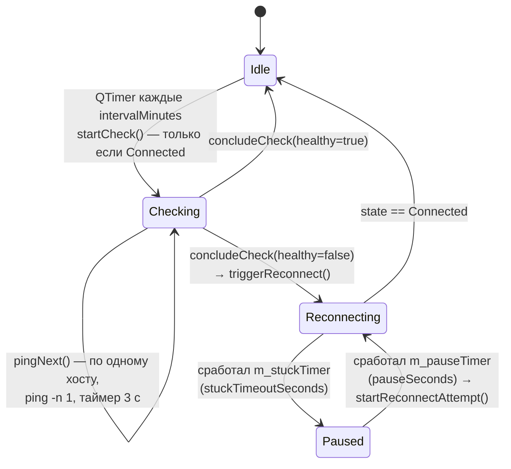

# 🔁 Auto-reconnect — как настроить и какие хосты прописать

> 🇬🇧 English version: [SETUP.md](./SETUP.md)
> 🏗️ Как это реализовано (код): см. [§6](#6-как-это-работает-карта-кода)

**Какую проблему решает:** VPN-туннель тихо умирает (ночной обрыв у провайдера, таймаут NAT, переключение Wi-Fi), клиент продолжает показывать *Connected*, и ничего не работает, пока не переподключишься вручную.
**Что делает:** раз в *N* минут клиент пингует список хостов **через туннель**; когда они перестают отвечать — отключается и заново подключается к серверу по умолчанию, с защитой от зависшего реконнекта.

Страница: **Settings → Auto-reconnect** (также по индикатору *Auto-reconnect enabled* на главном экране).

---

## 1. Настройки по порядку

| Настройка | По умолчанию | Смысл |
|---|---|---|
| **Auto-reconnect** (переключатель) | выкл | Главный тумблер. Watchdog следит только за *активным* подключением — с ручным отключением он не спорит. |
| **Check interval, minutes** | `10` (мин. 1) | Как часто пинговать список. |
| **Reconnect when…** | *all hosts unreachable* | `all hosts unreachable` — реконнект только когда **все** хосты недоступны (надёжно, рекомендуется). `any host unreachable` — реконнект, как только **один** хост упал (агрессивно; один нестабильный хост будет дёргать реконнект). |
| **Random ping order** | выкл | Перемешивать список перед каждой проверкой — не начинать всегда с одного и того же хоста. |
| **Stuck-connection recovery — timeout, s** | `120` (мин. 10) | Если *автоматический* реконнект висит в *Preparing/Connecting/Reconnecting* дольше — попытка прерывается. |
| **Stuck-connection recovery — pause, s** | `120` (мин. 5) | Пауза после прерванной попытки перед следующей. |
| **Hosts** | `1.1.1.1`, `8.8.8.8` | По хосту на строку; **Test** под каждым пингует его 4× прямо сейчас и показывает IP / пакеты / RTT; 🗑 удаляет. |
| **Check now** | — | Проверка немедленно (только при подключённом VPN). |
| **Event log** | все 4 категории вкл | Лог с таймстампами `%APPDATA%\AmneziaVPN\log\reconnect-events.log`, категории: *Connection*, *Auto-reconnect*, *Ping check*, *Host test*. Кнопки *Open* / *Clear*. |

Хост считается **доступным**, только если `ping` завершился с кодом 0 **и** в выводе есть `ttl=` — Windows возвращает 0 даже на *Destination host unreachable*, поэтому одному коду выхода не верим. Каждый пинг — один пакет с таймером убийства 3 секунды.

---

## 2. Какие хосты прописать — и зачем

Весь смысл — понять, что умер именно **туннель**, поэтому хосты должны быть адресами, которые **реально ходят через VPN**. Удобно думать о трёх уровнях и брать хотя бы по одному из A и B:

### Уровень A — «жив ли туннель вообще?»

| Хост | Зачем |
|---|---|
| **публичный IP вашего VPN-сервера** | Доступен ⇒ физический канал в порядке. У WireGuard/AWG пинг на IP сервера идёт *мимо* туннеля (маршрут endpoint'а), так что если он **падает** — проблема у провайдера, а не у VPN: реконнект не поможет, но и не навредит. Полезен как контрольная точка. |
| **внутренний шлюз туннеля** (например `10.8.0.1`, `10.8.1.1` — см. `Address` в конфиге) | Отвечает **только** через туннель. Не отвечает ⇒ туннель мёртв. Лучший одиночный индикатор, если сервер отвечает на ICMP на туннельном интерфейсе (серверы AmneziaWG/WG обычно отвечают; OpenVPN тоже). |

### Уровень B — «работает ли интернет через туннель?»

| Хост | Зачем |
|---|---|
| `1.1.1.1` (Cloudflare DNS) | Anycast, крайне надёжен, отвечает на ICMP отовсюду, джиттер ~1 мс. По умолчанию. |
| `8.8.8.8` (Google DNS) | То же, но другая сеть — вдвоём они почти никогда не падают одновременно. |
| `9.9.9.9` (Quad9) / `208.67.222.222` (OpenDNS) | Ещё независимые anycast-сети, если хочется 3–4 хоста. |

Указывайте **IP-адреса**, а не имена: мёртвый туннель часто означает мёртвый DNS, и неудачное разрешение имени засчиталось бы как «недоступен» не по той причине.

### Уровень C — «работает ли то, что мне реально нужно?»

| Хост | Зачем |
|---|---|
| сайт, которым пользуетесь через VPN (`youtube.com`, `github.com`, …) | Подтверждает реальный сценарий, а не только ICMP. Имена **здесь** допустимы — в связке с уровнем B, ведь DNS и есть часть того, что проверяем. |
| корпоративный хост за VPN (`10.0.0.5`, `intranet.example`) | Для офисных / site-to-site VPN — хост, который существует только внутри туннеля. |

Избегайте: хостов, режущих ICMP (многие корпоративные веб-серверы, `microsoft.com`), и всего, что ваши правила split-tunnel пускают **мимо** VPN (см. ниже) — они ответят, даже когда туннель мёртв.

### Взаимодействие со split tunneling ⚠️

- Split-tunneling *приложений* (Windows) работает **исключением** приложений; `ping.exe` не исключён, поэтому проверки идут через туннель. ✔
- Split-tunneling *сайтов* в режиме **«only forward listed sites»** пускает *всё остальное* мимо VPN — тогда `1.1.1.1` ответит и при мёртвом туннеле. В этом режиме либо **добавьте хосты для пинга в список форвардинга**, либо используйте *внутренний шлюз* из уровня A, который существует только внутри туннеля.
- В режиме **«bypass listed sites»** просто не вносите хосты для пинга в список.

### Рекомендуемые наборы

```
# Дом / общий случай (умолчание + шлюз туннеля)
1.1.1.1
8.8.8.8
10.8.1.1          # шлюз вашего туннеля из конфига

# Агрессивно, но безопасно: 4 хоста, режим "all unreachable"
1.1.1.1
8.8.8.8
9.9.9.9
10.8.1.1

# Офисный VPN
10.0.0.1          # шлюз туннеля
10.0.0.5          # нужный внутренний сервер
1.1.1.1
```

Режим **«all hosts unreachable»** + 3–4 хоста — золотая середина: падение одного хоста никогда не вызовет реконнект, а мёртвый туннель уронит все.

---

## 3. Интервалы и таймауты — как выбрать

- **Интервал 5–10 мин** для домашней линии. Одна проверка — это *N* одиночных пингов (несколько КБ); 1 минута тоже нормально, если нужно быстрое обнаружение.
- **Stuck timeout ≥ 60 с.** Нормальный реконнект занимает 3–20 с; это значение защищает от случая, который дал 8-часовое зависание в `Connecting…` в исходном логе. 120 с — безопасное умолчание.
- **Pause 60–300 с.** Даёт провайдеру/NAT время очухаться перед повтором; лимита попыток *нет* — цикл прервать → пауза → повтор продолжается, пока соединение не поднимется или вы не отключитесь вручную.

---

## 4. Как читать лог событий

```
[2026-07-17 03:12:04] [PING] Ping check: 0/3 reachable; unreachable: 1.1.1.1, 8.8.8.8, 10.8.1.1
[2026-07-17 03:12:04] [AUTO] Auto-reconnect triggered (unreachable: 1.1.1.1, 8.8.8.8, 10.8.1.1)
[2026-07-17 03:12:04] [AUTO] Auto-reconnect state: Disconnecting
[2026-07-17 03:12:05] [AUTO] Auto-reconnect state: Connecting
[2026-07-17 03:14:05] [AUTO] Auto-reconnect stuck in connecting for 120 s, pausing 120 s then retrying
[2026-07-17 03:16:05] [AUTO] Auto-reconnect: resuming after pause
[2026-07-17 03:16:12] [AUTO] Auto-reconnect: reconnected successfully
[2026-07-17 03:22:05] [PING] Ping check: 3/3 reachable
```

Теги: `[CONN]` ручные изменения подключения, `[AUTO]` реконнекты по инициативе watchdog'а, `[PING]` периодические проверки, `[TEST]` кнопка *Test* у хоста. Снимите галочку с категории на странице — она перестанет писаться (сразу, без перезапуска).

---

## 5. Если что-то не так

| Симптом | Причина / решение |
|---|---|
| *No hosts configured* | Список пуст — добавьте хотя бы один хост. |
| Каждая проверка даёт `0/N reachable`, хотя VPN работает | Хосты режут ICMP, или файрвол сервера роняет пинг внутри туннеля. Возьмите `1.1.1.1`/`8.8.8.8` или хост, который пингуется из терминала при подключённом VPN. |
| Хосты доступны при мёртвом туннеле | Они идут мимо VPN (режим split tunneling «only forward sites»). См. §2. |
| Реконнект каждый интервал | Режим *any host unreachable* и один хост нестабилен → переключите на *all* или уберите хост. |
| Реконнект не срабатывает никогда | Watchdog работает только в состоянии *Connected*; если клиент показывает *Disconnected* — это было ручное или серверное отключение, и оно намеренно не восстанавливается автоматически. |
| Windows: `ping` не найден | В `PATH` нет `%SystemRoot%\System32` — контроллер зовёт просто `ping`. |

---

## 6. Как это работает (карта кода)

Всё живёт в [`client/ui/controllers/reconnectController.{h,cpp}`](../../client/ui/controllers/reconnectController.cpp) и на странице [`client/ui/qml/Pages2/PageSettingsReconnect.qml`](../../client/ui/qml/Pages2/PageSettingsReconnect.qml); настройки — [`secureAppSettingsRepository.cpp:349-424`](../../client/core/repositories/secureAppSettingsRepository.cpp#L349-L424) (ключи `Conf/reconnect*`).



**Таймер → проверка** ([`reconnectController.cpp:447-489`](../../client/ui/controllers/reconnectController.cpp#L447-L489)): `restartTimer()` заводит `m_timer` на `intervalMinutes() * 60 * 1000`; `startCheck()` выходит, если проверка/реконнект уже идут или VPN не подключён, при необходимости перемешивает список и зовёт `pingNext()`.

**По одному хосту** ([`reconnectController.cpp:491-550`](../../client/ui/controllers/reconnectController.cpp#L491-L550)):

```cpp
#if defined(Q_OS_WIN)
    const QStringList args { "-n", "1", host };
#else
    const QStringList args { "-c", "1", host };
#endif
...
    // Require a real reply: some platforms (notably Windows) exit 0 even for
    // "Destination host unreachable", so we also look for a TTL in the output.
    const bool reachable = (exitStatus == QProcess::NormalExit) && (exitCode == 0)
            && output.toLower().contains("ttl=");
...
    m_pingKillTimer.start(kPingTimeoutMs);   // 3000 мс, reconnectController.cpp:20
    m_pingProcess->start("ping", args);
```

**Без раннего выхода, затем решение** ([`reconnectController.cpp:493-505`](../../client/ui/controllers/reconnectController.cpp#L493-L505)): пингуются все хосты, чтобы страница показала полный список `[OK]/[FAIL]`; потом

```cpp
const bool healthy = (failMode() == AllUnreachable) ? anyReachable : !anyUnreachable;
```

**Реконнект** ([`reconnectController.cpp:615-657`](../../client/ui/controllers/reconnectController.cpp#L615-L657)): `triggerReconnect()` выставляет `m_autoReconnectActive`, `startReconnectAttempt()` закрывает соединение с `m_reconnectPending = true`; обработчик *Disconnected* затем зовёт `openReconnect()` → `ConnectionController::openConnection(defaultServerId)`.

**Восстановление при зависании** ([`reconnectController.cpp:659-691`](../../client/ui/controllers/reconnectController.cpp#L659-L691), взводится в `onConnectionStateChanged`, [строки 707-709](../../client/ui/controllers/reconnectController.cpp#L707-L709)): каждый переход в *Preparing/Connecting/Reconnecting* перезапускает `m_stuckTimer(stuckTimeoutSeconds()*1000)`; если он срабатывает, а подключения всё нет:

```cpp
m_reconnectPending = false;
m_pausePending = true;
m_connectionController->closeConnection();
m_pauseTimer.start(pauseSeconds() * 1000);
```

и `onPauseTimeout()` снова зовёт `startReconnectAttempt()`. Достижение *Connected* останавливает оба таймера ([строки 711-716](../../client/ui/controllers/reconnectController.cpp#L711-L716)).

**Лог событий** ([`reconnectController.cpp:392`](../../client/ui/controllers/reconnectController.cpp#L392)): `logEvent(category, msg)` дописывает `[yyyy-MM-dd HH:mm:ss] [TAG] msg`, если бит категории установлен в `Conf/reconnectLogCategories` (битмаска `Connection=1, AutoReconnect=2, PingCheck=4, HostTest=8`, по умолчанию 15).
